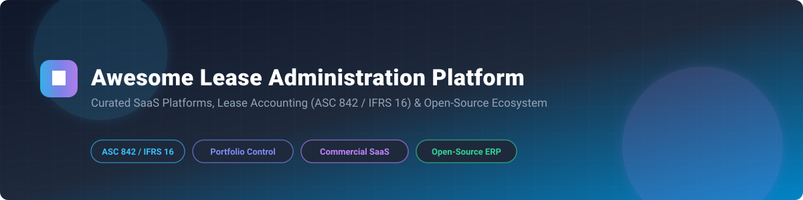

# 🏢 Awesome Lease Administration Platform 🚀

  

  
  
  
  
  

## 📌 Top Lease Administration & Accounting Platforms Ecosystem 💼

**Curated List of SaaS Products & Open-Source GitHub Projects** 📊

*Focused on Lease Accounting (ASC 842 / IFRS 16 / GASB 87), Portfolio Management, Critical Dates, Lease Abstracting & Real Estate / Equipment Leases* 🏢🚜

**Last updated: September 2026** 🗓️

---

### 🔍 Overview & Market Insights 💡

This repository tracks top commercial **SaaS platforms** and **open-source software** for **Lease Administration** and **Lease Accounting**. These enterprise platforms empower real estate teams, corporate lessees, accountants, and CFOs to centralize lease contracts (real estate, equipment, vehicle fleets), manage critical renewal dates, automate lease abstractions, compute compliance journal entries under ASC 842, IFRS 16, and GASB 87, and streamline financial audit reporting.

> 📊 **Market Size & Structure**: The Global Lease Accounting and Administration Software Market is estimated at **$2.5 Billion - $3.8 Billion** and is projected to reach **$6.5+ Billion** by 2030, growing at a CAGR of ~11.5%. The market is **moderately fragmented**, led by established IWMS/ERP giants (IBM, Planon, Accruent) and specialized lease compliance solutions (Visual Lease, LeaseAccelerator, Nakisa), with enterprise compliance demands preventing a single "winner-take-all" consolidation.

---

## 📑 Table of Contents 🗂️

- [📊 SaaS & Commercial Platforms](#-saas--commercial-platforms)
- [🔓 Open-Source GitHub Projects](#-open-source-github-projects)
- [🤝 How to Contribute](#-how-to-contribute)
- [⚠️ Disclaimer](#%EF%B8%8F-disclaimer)
- [📈 Star History](#-star-history)
- [💖 Support & Sponsorship](#-support--sponsorship)

---

## 📊 SaaS & Commercial Platforms 🏢

Below is a curated summary of top commercial enterprise lease administration and accounting platforms, sorted by estimated company revenue/valuation scale (descending).

| Platform | Starting Tier Price 🏷️ | Free Tier / Trial Limit ⏳ | Estimated Revenue / Valuation Scale 📈 | Key Description & Capabilities 📝 |
| :--- | :--- | :--- | :--- | :--- |
| **[IBM TRIRIGA](https://www.ibm.com/products/tririga)** 🏢 | \$1,120 / user / month (SaaS enterprise tier) | 30-day interactive sandbox trial (max 5 test user accounts) | **\$60.5B+ (IBM Parent Revenue)** | Enterprise IWMS & real estate portfolio suite with AI-driven lease accounting (ASC 842/IFRS 16), space planning, and capital projects. |
| **[Planon](https://planonsoftware.com/)** 🌐 | \$450 / module / month (base cloud subscription) | 14-day full-feature guided trial for corporate real estate teams | **\$150M - $250M Annual Revenue** | Integrated Workplace Management System (IWMS) offering end-to-end real estate management, lease compliance, and building IoT. |
| **[Lucernex (Accruent)](https://www.accruent.com/)** 📐 | \$350 / location / month (base administrative package) | 30-day corporate demo environment upon sales consultation | **\$100M - $200M (Accruent Revenue)** | Specialized enterprise real estate lifecycle & lease administration platform engineered for retail, restaurant, and multi-unit brands. |
| **[Visual Lease](https://www.visuallease.com/)** ⚡ | \$250 / month (billed annually for base asset tier) | 14-day free trial (up to 25 lease abstract uploads) | **\$50M - $100M ARR ($150M+ Valuation)** | Market leader in lease optimization and ASC 842 / IFRS 16 accounting, supporting rollups for corporate real estate and equipment portfolios. |
| **[LeaseAccelerator](https://www.leaseaccelerator.com/)** 🚀 | \$300 / month (starter tier for small portfolios) | 30-day limited trial environment (max 10 active asset schedules) | **\$40M - $80M ARR ($120M+ Valuation)** | Lease lifecycle automation platform specializing in equipment, asset-level tracking, complex discount rates, and corporate ERP posting. |
| **[Archibus](https://archibus.com/)** 🏛️ | \$200 / user / month (base facilities suite) | 30-day self-guided trial (limited to 1 building dataset) | **\$30M - $60M Annual Revenue** | Robust workplace & lease compliance module embedded within comprehensive facilities and space management software. |
| **[Nakisa Lease Administration](https://www.nakisa.com/)** 🌍 | \$500 / month (base enterprise cloud connector) | 14-day enterprise evaluation environment (max 15 contract abstracts) | **\$25M - $50M Annual Revenue** | Cloud-native enterprise lease accounting engine designed for complex global multi-currency portfolios with native SAP/Oracle integration. |
| **[ProLease](https://www.prolease.com/)** 📊 | \$150 / month (base workspace & lease package) | 14-day free demo account (max 5 lease entries) | **\$10M - $25M Annual Revenue** | User-friendly corporate real estate, lease administration, and accounting software built for accounting teams and brokers. |
| **[Lease Harbor](https://www.leaseharbor.com/)** ⚓ | \$125 / month (starter portfolio tier) | 30-day standard trial (up to 10 lease records) | **\$5M - $15M Annual Revenue** | Standardized, audit-ready lease administration and ASC 842 accounting platform offering predictable subscription pricing. |
| **[Leasecake](https://leasecake.com/)** 🧁 | \$99 / location / month (Growth plan) | 7-day free trial with full access (max 3 property locations) | **\$3M - $10M ARR ($20M+ Valuation)** | Modern, lightweight lease management app built for multi-unit franchisees and operators to track location critical dates & payments. |

---

## 🔓 Open-Source GitHub Projects 💻

Enterprise lease compliance software is predominantly commercial due to audit rigor. However, vibrant open-source ERP systems, property management solutions, and financial accounting engines provide customizable lease administration modules. 

Below are top open-source projects sorted by GitHub stars ⭐ (descending):

- **[Odoo](https://github.com/odoo/odoo)**   
  🤖 *Popular open-source suite of business apps, including contracts, real estate management, rental modules, and ASC 842 / IFRS 16 lease liability ledger integrations.*

- **[ERPNext / Frappe Framework](https://github.com/frappe/erpnext)**   
  💼 *Comprehensive open-source ERP supporting fixed assets, lease contract schedules, land administration, and financial journal entries.*

- **[GnuCash](https://github.com/gnucash/gnucash)**   
  📈 *Open-source double-entry accounting software capable of tracking right-of-use (ROU) asset schedules, amortization, and lease liabilities.*

- **[Akaunting](https://github.com/akaunting/akaunting)**   
  💸 *Free and online accounting software designed for small businesses to track lease payments, expenses, and tenant/landlord invoices.*

- **[Firefly III](https://github.com/firefly-iii/firefly-iii)**   
  💳 *Self-hosted financial manager providing recurring payment tracking, contract budgeting, and automated lease fee reminders.*

- **[Kill Bill](https://github.com/killbill/killbill)**   
  ⚡ *Open-source subscription billing and payment platform tailored for complex recurring lease agreements and property invoices.*

- **[MicroRealEstate](https://github.com/microrealestate/microrealestate)**   
  🏠 *Self-hosted property management web application for landlords to manage lease documents, rent collection, and tenant automated receipts.*

- **[PropMS (ERPNext Property Management)](https://github.com/inayatkh/propms)**   
  🏢 *Dedicated property management extension built on top of ERPNext to manage unit leasing, rent collection, and maintenance workflows.*

---

## 🛠️ Additional Open-Source Implementations & Architecture 🏗️

- **ERPNext + PropMS Stack**: Ideal for small-to-medium real estate firms requiring integrated operational lease tracking and accounting.
- **Odoo Rental & Contract Engine**: Configurable for equipment lease management and asset payment schedules.
- **Custom Lease Accounting Pipeline**: Store lease abstracts in an open SQL database → generate ASC 842 amortization schedules via Python/Pandas → push automated journal entries to Akaunting or ERPNext.

---

## 🤝 How to Contribute 🛠️

Contributions are welcome! Please follow these simple guidelines:

1. Fork this repository 🍴
2. Add your product or project to `README.md` maintaining the formatted table/list style ✍️
3. Include factual details (pricing, star badges, features) 📌
4. Submit a Pull Request with a clear description 🚀

---

## ⚠️ Disclaimer 📜

- This repository is a **community-curated list** for informational and educational purposes.
- Compliance standards (ASC 842, IFRS 16, GASB 87) require certified audit controls. Always verify financial outputs with qualified CPA/accounting professionals.

---

## 📈 Star History 🌟

---

## 💖 Support & Sponsorship ☕

If you find this repository useful for your corporate real estate or finance research, please consider supporting the project:

- ⭐ **Star** this repository to increase visibility!
- 🔀 **Fork** and contribute new lease tools!
- 📢 **Share** with your finance and CRE teams!
- ☕ **Buy me a coffee**: Support ongoing maintenance on the [GitHub Sponsor Dashboard](https://github.com/sponsors/ishandutta2007)!

Thank you for your support! ❤️
